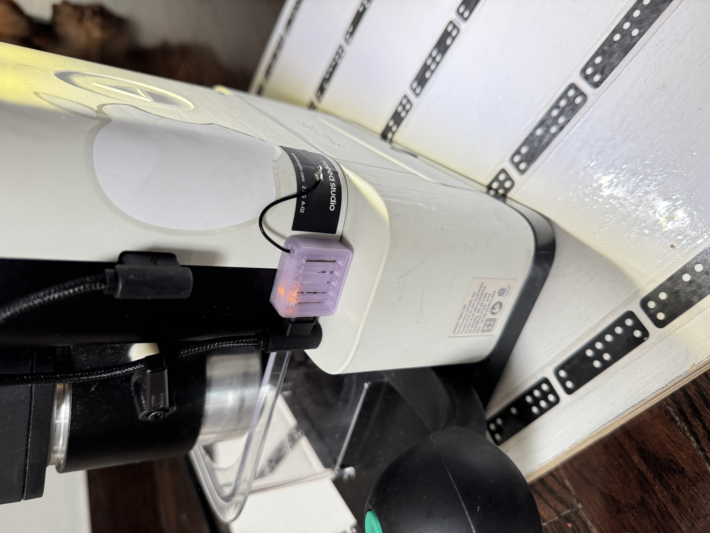
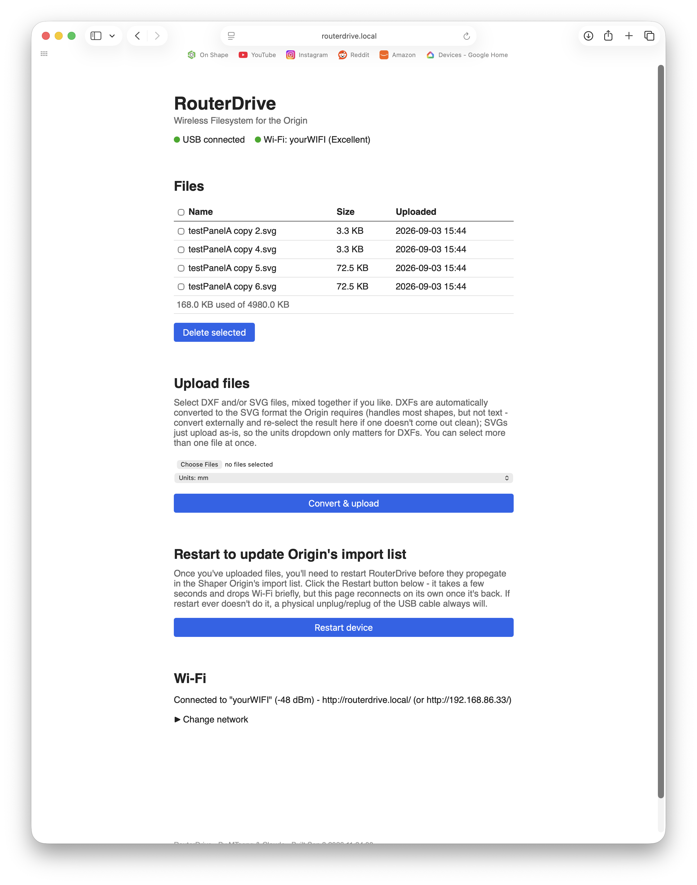
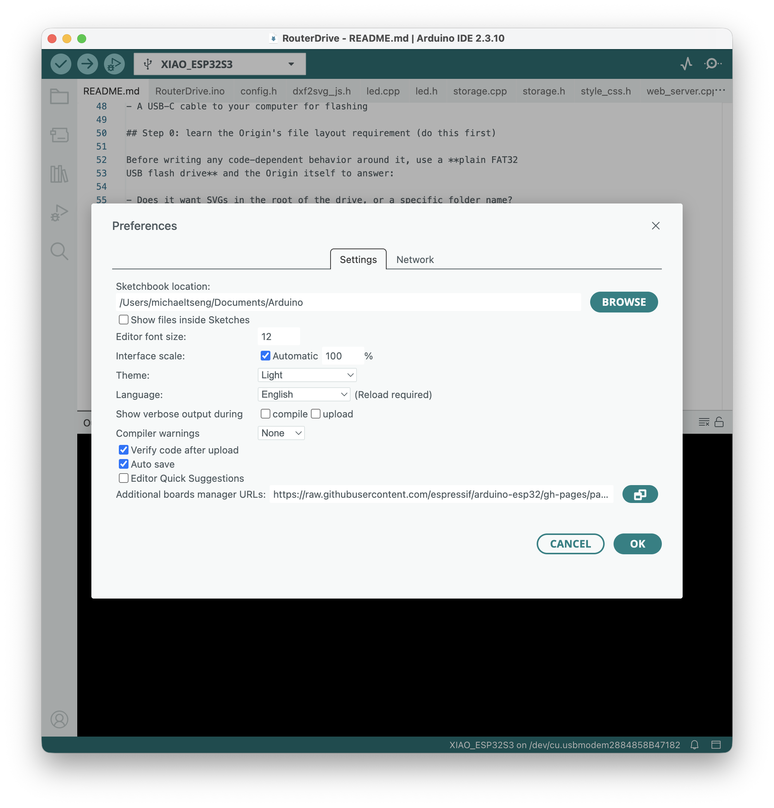
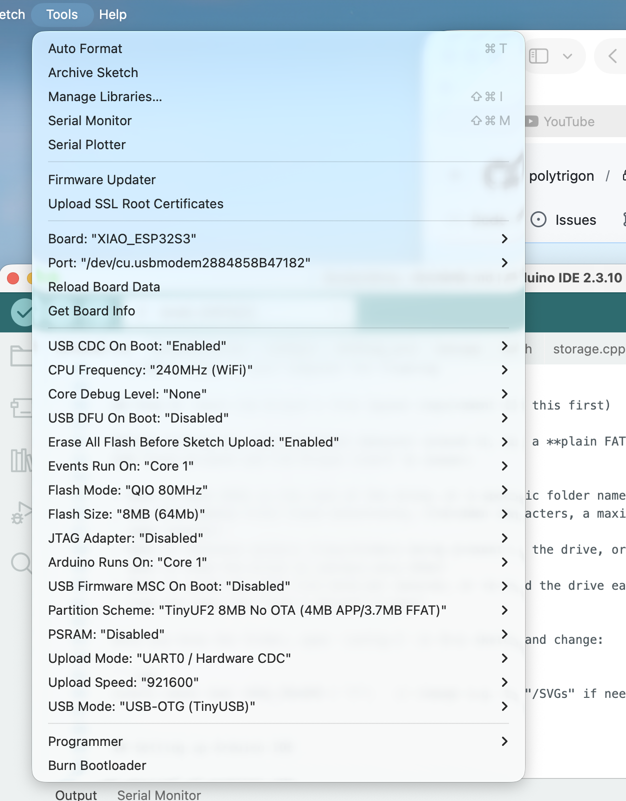

# RouterDrive

*RouterDrive is an independent, unofficial project and is not affiliated with, endorsed by, or sponsored by Shaper Tools, Festool, or their parent companies.*

I've created a gadget to help the community with uploading files to their Shaper. It costs very little in parts (less than $15). This project will always be open source and free.



## What is it?

RouterDrive is a simple program that you flash onto a Seeed XIAO ESP32-S3 board, which you then plug into your Shaper Origin via USB. It lets you wirelessly upload DXF (auto-converts to SVG) and SVG files - your Origin sees it as a regular ol' thumb drive. If you're lazy like me and can't be bothered to walk a thumb drive from your computer over to the Origin, this is the tool for you!

## Why did you create this?

It started with a conversation on another thread about alternative ways to get files onto the Shaper Origin besides Shaper Hub. User Beau pointed out that there's a USB-A port you can plug a thumb drive into with SVG files on it. Cool, but I'm lazy, so I started wondering if there was a way to just upload over the air instead. Beau also pointed out that [someone had already built this for 3D printers](https://github.com/Kabani-Tech/PrintDrop/tree/main). I decided to make a version a little more tailored to the Origin.

## Bill of materials

- [Seeed XIAO ESP32S3](https://www.seeedstudio.com/XIAO-ESP32S3-p-5627.html) - the WiFi model. Seeed's XIAO line comes in several flavors (not all of them have WiFi), so double check you're getting this one. About $8 direct from Seeed, a bit more on Amazon.
- USB-A to USB-C cable - something short is nice, 6" or so.
- Basic comfort uploading a sketch through Arduino IDE - less intimidating than it sounds, we'll walk through it below.
- A small strip of 3M VHB tape, to stick it to your Shaper.
- A computer (of course!)

## How's it work?

Once RouterDrive is connected to your Wi-Fi network and plugged into the Shaper Origin's USB port, visit `routerdrive.local` in a browser and you'll see the interface below. From there you can upload SVG and DXF files - DXFs convert to SVG automatically. Hit "Restart RouterDrive," and once it reboots (a few seconds), your files show up on the Origin in the "+ Import" folder.



[Watch it in action](assets/filesUploading.MOV) - a quick look at uploading files and seeing them land on the Origin.

## Quick note to the Shaper devs

If anyone up in the sky is listening, it would be amazing if you could get the USB-A "nudge" working - that would be so sweet! But no matter - thanks for creating a great tool.

## How to install + set up RouterDrive

You've got all the parts together and you're ready to get this thing installed - it's done in 6 pain-free steps.

1. Set up [Arduino IDE](https://www.arduino.cc/en/software/)
2. Download the RouterDrive `.zip` file
3. Connect your ESP32-S3 to your computer and flash it with RouterDrive
4. Connect to your ESP32-S3's Wi-Fi network and enter your workshop Wi-Fi credentials
5. Plug RouterDrive into your Shaper Origin's USB port
6. Use the browser interface at `routerdrive.local` to upload files

### 1. Set up Arduino IDE

This is by far the most daunting step for folks who've never futzed with Arduino IDE before, but I assure you we'll get through it together. Already got this part done? Feel free to skip ahead.

Arduino IDE is how we'll talk to the ESP32-S3 board and install the RouterDrive software.

1. Begin by downloading and installing [Arduino IDE](https://www.arduino.cc/en/software/) (2.x) for your OS - the usual installer, nothing special.
2. Open Arduino IDE, then go to **File > Preferences** (on a Mac, that's **Arduino IDE > Settings**). In the "Additional boards manager URLs" box, paste this:
   ```
   https://raw.githubusercontent.com/espressif/arduino-esp32/gh-pages/package_esp32_index.json
   ```
   This is what tells Arduino IDE how to talk to ESP32-family boards, XIAO included - none of that support ships in Arduino IDE by default.

   
3. Go to **Tools > Board > Boards Manager**, search for "esp32," and install the one published by **Espressif Systems**. This one takes a few minutes - it's downloading the whole toolchain, not just a driver.
4. Plug your XIAO ESP32S3 into your computer with a USB-C cable.
5. Go to **Tools > Board**, find the **esp32** section, and select **XIAO_ESP32S3**.
6. Go to **Tools > Port** and select the port that just appeared. If you only see one new option, that's it - it may show up as something generic like "USB Serial" or list the board name directly, depending on your OS.
7. Last thing before we touch any code: a handful of settings in the **Tools** menu need to be set exactly right, or the sketch either won't compile or the USB drive won't work once it's running. Set these:

   | Setting | Value |
   |---|---|
   | USB Mode | **USB-OTG (TinyUSB)** |
   | USB CDC On Boot | **Enabled** |
   | USB Firmware MSC On Boot | **Disabled** |
   | Partition Scheme | **TinyUF2 8MB No OTA (4MB APP/3.7MB FFAT)** |
   | Upload Mode | leave on the default |

   Don't worry about memorizing what each of these does - just match the table. ("TinyUF2" in that partition scheme's name is just what Arduino calls that particular flash layout; picking it doesn't change how you upload code or require any extra bootloader step.)

   

That's Arduino IDE fully set up - you won't need to repeat any of this the next time you want to reflash RouterDrive, just steps 2 and 3 below.

### 2. Download the RouterDrive `.zip` file

1. Download [`RouterDrive.zip`](RouterDrive.zip) from the top of this repo and unzip it wherever's convenient - that's just the sketch folder, ready to go. (Rather grab the whole repo instead? Click the green **Code** button → **Download ZIP**, or `git clone` it - the sketch lives in the `RouterDrive` folder either way.)
2. However you got it, make sure `RouterDrive.ino` sits directly inside a folder named `RouterDrive` (not nested another folder deeper). Arduino IDE is picky about this - the sketch folder name has to match the `.ino` file name exactly, or it won't open properly.
3. Double-click `RouterDrive.ino` to open it in Arduino IDE. You'll see a row of tabs across the top (`config.h`, `storage.cpp`, `web_server.cpp`, etc.) - that's normal, they're all part of the same sketch and load together automatically.

### 3. Connect your ESP32-S3 to your computer and flash it

1. With the XIAO still plugged into your computer via USB-C, click the checkmark (**Verify**) button first. This just compiles the code without uploading it, so if something's off with the Tools-menu settings from step 1, you'll find out now instead of partway through flashing.
2. Once that succeeds, click the arrow (**Upload**) button. This takes a minute or two.
3. Open **Tools > Serial Monitor**, set the baud rate (bottom-right of that window) to **115200**. You should see RouterDrive's own log messages scroll by - mounting storage, starting its Wi-Fi setup hotspot, and so on. If you see that, the flash worked.

### 4. Connect to your ESP32-S3's Wi-Fi network and enter your workshop Wi-Fi credentials

1. On first boot (and any time it doesn't have saved Wi-Fi credentials), RouterDrive broadcasts its own hotspot named **RouterDrive-Setup** (password: `routerdrive`). Join it from your phone or laptop like any other Wi-Fi network.
2. Your device may pop up a "sign in to network" prompt on its own - if it does, that's the page you want. If it doesn't, just open `http://192.168.4.1/` in a browser yourself.
3. Enter your workshop's Wi-Fi name and password and submit. RouterDrive restarts and tries to join that network - the setup hotspot disappears once it does.
4. Once it's connected, you'll find it from then on at `routerdrive.local` in any browser on that same network - no more setup hotspot needed unless you reset it or move it to a different Wi-Fi network later.

   *(Don't want to give it your home Wi-Fi at all? You can skip this step entirely and use RouterDrive straight off its own hotspot instead - there's a note for how on the setup page itself.)*

### 5. Plug RouterDrive into your Shaper Origin's USB port

Before it ever touches the Origin, it's worth a quick check on your own computer first: plug RouterDrive into your computer's USB-C port instead, confirm your computer sees it as an ordinary flash drive, and upload/delete a test file or two from the web UI to make sure it's actually landing on the drive.

Once that all checks out:

1. Plug RouterDrive into the Shaper Origin's USB-A port using your USB-A-to-USB-C cable. That cable is both the power and data connection, so RouterDrive needs to stay plugged in here (not powered separately) to work.
2. On the Origin, confirm it shows up as a drive and that you can open an SVG you uploaded over Wi-Fi.

### 6. Use the browser interface at `routerdrive.local` to upload files

This is the step you'll actually repeat every time you want new files on the Origin:

1. From any device on the same Wi-Fi network, visit `routerdrive.local` in a browser.
2. Under "Upload files," select one or more DXF and/or SVG files (mixing both in one go is fine) - DXFs convert to SVG automatically, SVGs just upload as-is.
3. If you selected any DXFs, pick mm or inches from the units dropdown - it only affects those, SVGs ignore it.
4. Click **Convert & upload**. You'll see a status line tracking progress, and each file that just landed gets a small green checkmark next to it in the file list.
5. Click **Restart RouterDrive**. In practice, the Origin's import list usually needs this nudge to actually notice a new file - it takes a few seconds and briefly drops Wi-Fi, then reconnects on its own.
6. Your new file(s) should now show up in the Origin's "+ Import" folder. If they don't, a physical unplug/replug of the USB cable will always work as a last resort, same as with any ordinary flash drive.

That's it - you're up and running!

## More detail / troubleshooting

The [`RouterDrive/README.md`](RouterDrive/README.md) inside this repo covers the build in more technical depth - exact firmware behavior, a full bring-up checklist, the status LED reference, resetting Wi-Fi credentials, and known rough edges. Worth a look if something above doesn't go as expected.

